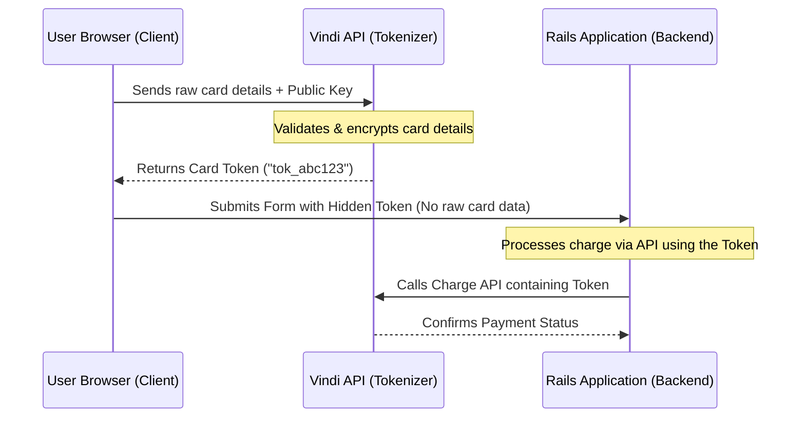

## PCI compliance and the risk of handling raw cards on the backend

When designing transparent checkout systems on the web, the number one rule of security is: **never let raw credit card details (card number, CVV) reach or flow through your application server**.

Violating this rule forces your organization to comply with the most complex and expensive levels of payment security certifications (**PCI DSS** - *Payment Card Industry Data Security Standard*). If raw card details touch your backend servers (whether in Rails logs, memory buffers, or database fields), any application vulnerability exposes sensitive financial data to attackers.

The industry-standard solution is **Edge Tokenization** (encrypting in the customer's browser). The Rails Engine [`vindi-rails-engines`](https://github.com/wesleyskap/vindi-rails-engines) was created to automate and encapsulate this architectural pattern cleanly in Ruby on Rails.

---
## How edge tokenization works

The direct client-side tokenization pattern follows a simple, secure sequence:



---
## Implementing with vindi-rails-engines

The `vindi-rails-engines` gem provides generators to initialize views and pre-configured Stimulus JS controllers in your Rails application:

```bash
$ rails generate vindi:checkout
```

This injects the required assets. The heart of the implementation is the Stimulus JS controller connected to your payment form:

```javascript
// app/javascript/controllers/vindi_checkout_controller.js
import { Controller } from "@hotwired/stimulus"

export default class extends Controller {
  static targets = [ "publicKey", "holderName", "cardNumber", "expiry", "cvv", "tokenInput" ]

  tokenizeCard(event) {
    event.preventDefault() // Prevents default form submission
    
    // Initialize Vindi client with Public Key
    const vindi = new Vindi(this.publicKeyTarget.value)
    
    vindi.createToken({
      holder_name: this.holderNameTarget.value,
      card_number: this.cardNumberTarget.value.replace(/\s+/g, ''),
      card_expiration: this.expiryTarget.value,
      card_cvv: this.cvvTarget.value
    }).then((response) => {
      // Inject the generated token (e.g. "tok_3278918239abc") into the hidden field
      this.tokenInputTarget.value = response.token
      
      // Submit the form safely to the Rails server
      this.element.submit()
    }).catch((error) => {
      alert("Card validation failure: " + error.message)
    })
  }
}
```

### The checkout html/erb form

The generated HTML form excludes the `name` attribute from sensitive card inputs. This ensures that even if JavaScript fails or the form is submitted by accident, the browser will not send the raw fields to your backend:

```erb
<%= form_with url: process_payment_path, method: :post, data: { controller: "vindi-checkout", action: "submit->vindi-checkout#tokenizeCard" } do |f| %>
  <!-- Encrypted Vindi Public Key -->
  <input type="hidden" data-vindi-checkout-target="publicKey" value="<%= ENV['VINDI_PUBLIC_KEY'] %>">
  
  <!-- Hidden Field to hold the token value -->
  <input type="hidden" name="payment_profile_token" data-vindi-checkout-target="tokenInput">

  <div class="form-group">
    <label>Cardholder Name</label>
    <input type="text" data-vindi-checkout-target="holderName" placeholder="JOHN DOE">
  </div>

  <div class="form-group">
    <label>Card Number</label>
    <input type="text" data-vindi-checkout-target="cardNumber" placeholder="4111 1111 1111 1111">
  </div>

  <div class="form-row">
    <div class="form-group">
      <label>Expiration Date</label>
      <input type="text" data-vindi-checkout-target="expiry" placeholder="12/2030">
    </div>
    <div class="form-group">
      <label>CVV</label>
      <input type="text" data-vindi-checkout-target="cvv" placeholder="123">
    </div>
  </div>

  <button type="submit" class="btn btn-primary">Subscribe</button>
<% end %>
```

---
## Processing the token on the Rails backend

Once the form submits, your controller receives only the `payment_profile_token`. This token can safely travel through your routing stack and be persisted in logs or database tables. To create the subscription, pass the token as a reference parameter:

```ruby
class PaymentsController < ApplicationController
  def process_payment
    Vindi::Subscription.create(
      customer_id: current_user.vindi_customer_id,
      plan_id: params[:plan_id],
      payment_method_code: "credit_card",
      payment_profile: {
        token: params[:payment_profile_token]
      }
    )
    redirect_to root_path, notice: "Subscription created successfully!"
  rescue Vindi::Error => e
    redirect_to new_payment_path, alert: "Billing failed: #{e.message}"
  end
end
```

By leveraging this architecture, cardholder details never cross your servers, minimizing security overhead and protecting your clients against data leaks.

---
## Technical terms demystified

*   **PCI DSS:** Payment Card Industry Data Security Standard. A comprehensive security protocol managed by major credit card networks to secure transactions.
*   **Tokenization:** The process of swapping out sensitive data for secure, non-sensitive tokens generated through cryptographic handshakes or random generation.
*   **Stimulus JS:** A modest JavaScript framework built by the creators of Rails (Basecamp), designed to bind interactions to server-side HTML layouts easily.
