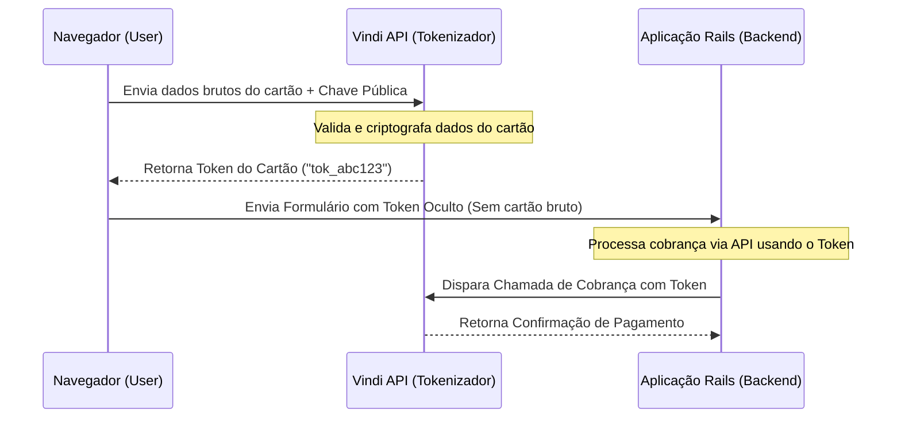

## PCI compliance e o perigo do tráfego de cartões no backend

Quando projetamos sistemas de pagamento transparente na web, a regra número um de segurança é: **nunca trafegue ou armazene dados brutos do cartão de crédito (número do cartão, CVV) no servidor da sua aplicação**. 

O descumprimento desta regra obriga sua empresa a se adequar aos níveis mais rígidos e caros de certificação de segurança da indústria de cartões de pagamento (**PCI DSS** - *Payment Card Industry Data Security Standard*). Se dados brutos de cartão tocarem no seu servidor backend (logs do Rails, memória RAM ou banco de dados), qualquer vulnerabilidade no seu sistema expõe esses dados sensíveis a invasores.

A solução padrão do mercado é a **Tokenização na Borda** (no navegador do usuário). E a Rails Engine [`vindi-rails-engines`](https://github.com/wesleyskap/vindi-rails-engines) foi criada especificamente para empacotar e automatizar essa arquitetura no Rails de forma limpa.

---
## Como funciona a criptografia na borda?

A arquitetura de tokenização direta segue um fluxo simples e seguro de ponta a ponta:



---
## Implementando com vindi-rails-engines

A gem `vindi-rails-engines` disponibiliza geradores para copiar views HTML/ERB e controladores Stimulus JS pré-configurados para a sua aplicação:

```bash
$ rails generate vindi:checkout
```

Isso injeta a infraestrutura necessária na sua aplicação. O coração desse fluxo reside no controlador Stimulus JS criado no seu front-end:

```javascript
// app/javascript/controllers/vindi_checkout_controller.js
import { Controller } from "@hotwired/stimulus"

export default class extends Controller {
  static targets = [ "publicKey", "holderName", "cardNumber", "expiry", "cvv", "tokenInput" ]

  tokenizeCard(event) {
    event.preventDefault() // Evita o envio padrão do formulário ao backend
    
    // Inicializa a Vindi com a Chave Pública
    const vindi = new Vindi(this.publicKeyTarget.value)
    
    vindi.createToken({
      holder_name: this.holderNameTarget.value,
      card_number: this.cardNumberTarget.value.replace(/\s+/g, ''),
      card_expiration: this.expiryTarget.value,
      card_cvv: this.cvvTarget.value
    }).then((response) => {
      // Injeta o token gerado (ex: "tok_3278918239abc") no input oculto
      this.tokenInputTarget.value = response.token
      
      // Submete o formulário com segurança ao Rails
      this.element.submit()
    }).catch((error) => {
      alert("Erro na validação do cartão: " + error.message)
    })
  }
}
```

### O formulário erb correspondente

O formulário gerado utiliza tags HTML sem o atributo `name` nos campos confidenciais do cartão. Isso garante que, mesmo se o Javascript falhar ou o formulário for submetido por engano, os navegadores não enviarão os campos vazios ao Rails:

```erb
<%= form_with url: process_payment_path, method: :post, data: { controller: "vindi-checkout", action: "submit->vindi-checkout#tokenizeCard" } do |f| %>
  <!-- Chave pública Vindi injetada de forma estática -->
  <input type="hidden" data-vindi-checkout-target="publicKey" value="<%= ENV['VINDI_PUBLIC_KEY'] %>">
  
  <!-- Input Oculto para receber o Token retornado -->
  <input type="hidden" name="payment_profile_token" data-vindi-checkout-target="tokenInput">

  <div class="form-group">
    <label>Nome Impresso no Cartão</label>
    <input type="text" data-vindi-checkout-target="holderName" placeholder="JOÃO SILVA">
  </div>

  <div class="form-group">
    <label>Número do Cartão</label>
    <input type="text" data-vindi-checkout-target="cardNumber" placeholder="4111 1111 1111 1111">
  </div>

  <div class="form-row">
    <div class="form-group">
      <label>Validade</label>
      <input type="text" data-vindi-checkout-target="expiry" placeholder="12/2030">
    </div>
    <div class="form-group">
      <label>CVV</label>
      <input type="text" data-vindi-checkout-target="cvv" placeholder="123">
    </div>
  </div>

  <button type="submit" class="btn btn-primary">Assinar Plano</button>
<% end %>
```

---
## Processando o token no backend Rails

Uma vez que o formulário é submetido, o seu controller no backend recebe apenas o `payment_profile_token`. Esse token é perfeitamente seguro para transitar pelo seu servidor e ser persistido. Para efetuar a assinatura, basta repassar o token:

```ruby
class PaymentsController < ApplicationController
  def process_payment
    Vindi::Subscription.create(
      customer_id: current_user.vindi_customer_id,
      plan_id: params[:plan_id],
      payment_method_code: "credit_card",
      payment_profile: {
        token: params[:payment_profile_token]
      }
    )
    redirect_to root_path, notice: "Assinatura concluída com sucesso!"
  rescue Vindi::Error => e
    redirect_to new_payment_path, alert: "Erro no faturamento: #{e.message}"
  end
end
```

Usando esta arquitetura, os dados confidenciais do cartão nunca tocam na sua infraestrutura, reduzindo os custos de segurança e assegurando proteção máxima contra vazamento de dados.

---
## Termos técnicos desmistificados

*   **PCI DSS:** Padrão de segurança de dados global estabelecido pelo conselho de bandeiras de cartões para garantir que todas as empresas que processam ou armazenam cartões de crédito mantenham ambientes seguros.
*   **Tokenização:** O processo de substituir dados confidenciais por equivalentes não confidenciais (tokens) gerados aleatoriamente ou por criptografia de chave pública.
*   **Stimulus JS:** Um framework javascript modesto e focado em HTML, mantido pela equipe do Basecamp/Rails, ideal para adicionar comportamento a páginas renderizadas no servidor.
